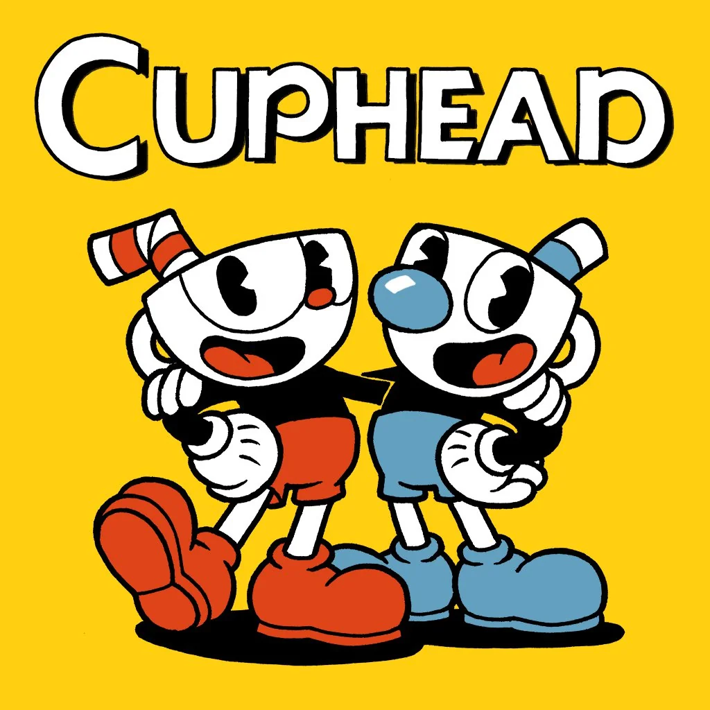

# Cuphead

  

Welcome to the Cuphead educational recreation project! This repository is dedicated to my educational initiative where i aim to recreate certain aspects of the game, [Cuphead](https://store.steampowered.com/app/268910/Cuphead/) , developed by [StudioMDHR](http://studiomdhr.com/). Please note that this project is purely educational and not affiliated with the official Cuphead game or its creators.

# Levels 

## Tutorial Level

Recreation of the tutorial level from the original game. The player is able to move around the level and interact with the tutorial objects.

  

## The Root Pack

Recreation of the first level from the original game. The Root Pack contains three bosses: Potato, Ollie Bulb, and  Chauncey Chanteny.

  

# Tools Used

- [Unity](https://unity.com/)
- [Visual Studio](https://visualstudio.microsoft.com/)

# Assets Attribution

I'd like to extend my gratitude to the following sources for providing the assets used in this educational project:

  - Sprites: The artwork used in this project is from https://www.spriters-resource.com/pc_computer/cupheaddontdealwiththedevil/.

  - Music: The music samples used for educational purposes are sourced from https://drive.google.com/drive/u/1/folders/0B6WoEC7gbB6sU21Fd0lucDVuWTg?resourcekey=0-B-_vlHZgTaGlMI2ptNnpvQ.

    
# Legal Disclaimer

This educational project is developed independently and is not officially endorsed by StudioMDHR. All intellectual property rights for the original Cuphead game, including its characters, artwork, music, and other elements, belong to StudioMDHR.
